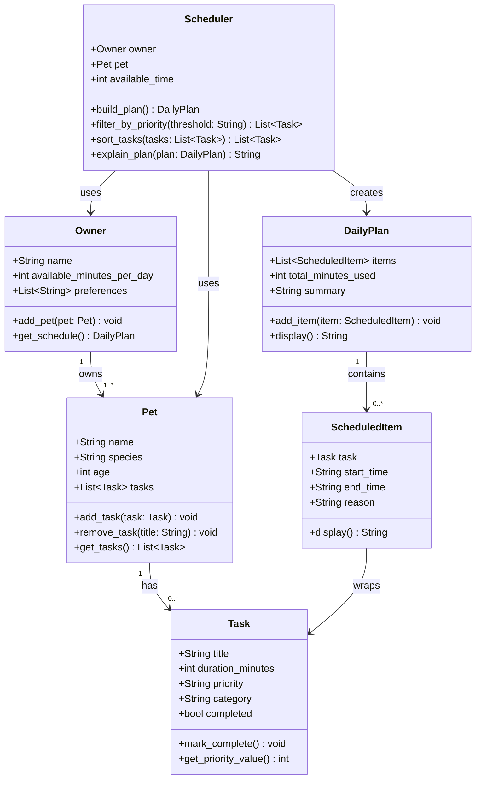

# PawPal+ UML Class Diagram

## Three Core User Actions

1. **Add a Pet** — The user enters owner info and pet details (name, species, age). An `Owner` object is created with a linked `Pet`.

2. **Add/Manage Care Tasks** — The user adds tasks (e.g., morning walk, feeding, meds) with a duration and priority. Tasks are stored on the `Pet`.

3. **Generate a Daily Schedule** — The user triggers the `Scheduler`, which filters and sorts `Task` objects by priority and available time, then returns a `DailyPlan` explaining what was chosen and why.
